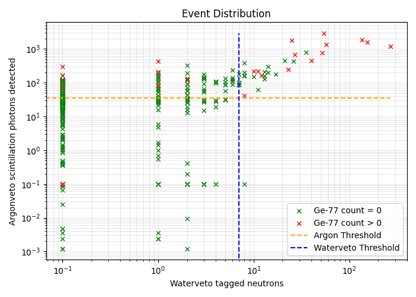

# recosm

This repository contains tools and analyses for studying the production of cosmogenic **Ge-77 isotopes** using [remage](https://github.com/legend-exp/remage).

It includes simulations and post-processing that were used to generate the following plot:

> **Note:** Some input files are missing because they contain confidential LEGEND internal data. Each sub-folder explains which files are required in its own `Readme.md`.  

If you are a **LEGEND member**, you can contact me to obtain the missing files. Otherwise, you can replace them with your own input files to explore alternative setups.

## Repository Structure

Each sub-folder contains its own `Readme.md` that explains its purpose and usage. Explore them individually to understand the workflow.

